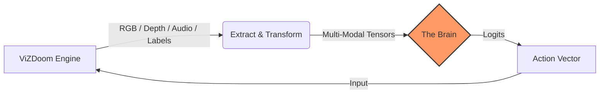

# Golem: The DOOM LNN Project

**Golem** is an open-source initiative to develop autonomous, adaptive agents for *DOOM* using **Liquid Neural Networks (LNNs)**.

Current AI in *DOOM* relies on finite state machines (FSMs) written in the 90s. While functional, they are predictable and stateless. Golem aims to replace these static heuristics with **Neural Circuit Policies (NCPs)**—biologically inspired neural networks that model time as a continuous flow rather than discrete ticks.

!!! quote "Why Liquid Networks?"
    Unlike Large Language Models (LLMs) which hallucinate state, or traditional Reinforcement Learning (RL) which requires millions of training steps, LNNs are:
    
    * **Causal:** They learn cause-and-effect relationships in noisy environments.
    * **Compact:** Runnable on consumer hardware with minimal latency (<20ms).
    * **Continuous:** They handle the variable time-steps of a game engine natively via Ordinary Differential Equations (ODEs).

---

## 🏗 System Architecture

The project follows a strict **ETL (Extract, Transform, Load)** pipeline pattern to decouple the game engine from the multi-modal inference model. 



### Data Pipeline Phases

1. **Extract (Perception):** Interfaces with `libvizdoom` to capture the raw phenomenological buffers (RGB screen, stereoscopic depth, high-frequency stereo audio, and semantic labels). Latent game variables (health, ammo, coordinates) are explicitly discarded to force multi-modal heuristic learning.
2. **Transform (Normalization & DSP):** * **Visual & Depth:** Downsampling via bilinear interpolation (64x64) and min-max scaling ().
    * **Thermal:** Binary thresholding of the semantic labels buffer to isolate active entities, followed by nearest-neighbor downsampling (64x64).
    * **Audio:** Zero-mean, unit-variance normalization, transformed via STFT into dense 2D time-frequency Mel Spectrograms, and logarithmically scaled to decibels.
    * **Channel Permutation:** Matrix transposition for PyTorch (`N, C, H, W`).

3. **Load (Inference/Training):** Feeds dynamic sequence tensors into the parallel Convolutional Neural Networks (Visual, Auditory, Thermal cortices) before concatenating the latent features into the **Neural Circuit Policy (NCP)** to generate action probability distributions.

---

## 🚀 Setup

!!! warning "System Prerequisites"
    * **Python:** 3.10+
    * **C++ Compiler:** ViZDoom requires a modern C++ compiler (clang/gcc) and libraries (SDL2, OpenAL) if building wheels from source.
    * **Hardware Acceleration:**
        * **Apple Silicon:** Metal (MPS) is supported automatically.
        * **NVIDIA:** Requires CUDA 11.8+.

=== "Bash / Zsh"

    ```bash
    # 1. Create Virtual Environment
    python -m venv .venv
    source ./.venv/bin/activate
    # 2. Install Dependencies
    pip install -r requirements.txt
    ```

=== "Fish"

    ```fish
    # 1. Create Virtual Environment
    python -m venv .venv
    source ./.venv/bin/activate.fish
    # 2. Install Dependencies
    pip install -r requirements.txt
    ```

---

## 🛠 Usage Cycle

Golem operates in a continuous iterative loop. Select a phase below to view the command syntax.

=== "1. Configure"

    Before running, verify your hyperparameters, architectural depths, and active profile in **`conf/app.yaml`**. 

    The `training.config` string defines which superset of actions the agent learns:

    * **`basic`**: 8 dimensions (Movement, Attack, Use).
    * **`classic`**: 10 dimensions (Basic + explicit `slot 2` and `slot 3` keys).
    * **`fluid`**: 9 dimensions (Basic + `weapnext`).

    The `brain.sensors` block enables multi-modal phenomenological fusion:

    * **`visual`**: Base RGB screen buffer.
    * **`depth`**: Stereoscopic distance matrix.
    * **`audio`**: High-frequency waveforms transformed into 2D Mel Spectrograms.
    * **`thermal`**: Binary semantic segmentation masks to isolate dynamic entities.

=== "2. Record"

    Launch the engine in **Spectator Mode** to capture training data. The engine binds keys dynamically based on the active profile in `app.yaml`.

    ```bash
    # Usage: python main.py record --module <module_name>
    python main.py record --module combat
    ```

=== "3. Inspect"

    Verify your dataset is balanced and normalized before training via Jinja2 template reports.

    ```bash
    python main.py inspect
    ```

    !!! tip
        Look for **High Idle Time**. If the agent spends >50% of the time doing nothing, the model will converge to inaction due to gradient sparsity.


=== "4. Train"

    Run the **Behavioral Cloning** loop to map the multi-modal observations to action vectors via Binary Cross-Entropy. The DataLoader automatically applies dynamic spatial Mirror Augmentation.

    ```bash
    # Trains on ALL available data modules across the active profile
    python main.py train --module all
    ```

=== "5. Audit"

    Run a diagnostic Brain Scan to check for class-imbalance failures against the test data.

    ```bash
    # Cap the evaluation to 50 sequence batches
    python main.py audit --module all

    # Run a full-corpus evaluation without overlapping sequence strides
    python main.py audit --module all --full
    ```

=== "6. Intervene"

    Launch the agent autonomously. If the agent enters an equilibrium state (e.g., staring at a corner), hold **Left Shift** to suspend the LNN logits and capture raw keyboard overrides. 

    ```bash
    python main.py intervene --module combat
    ```

    Releasing the key automatically dumps a `_recovery` trace file to cure Covariate Shift.

=== "7. Summary"

    Generate a topological breakdown of the active neural architecture via `torchinfo`. This executes a dummy forward pass to validate that the active sensor cortices are dynamically scaling and concatenating properly into the liquid core.

    ```bash
    python main.py summary
    ```

=== "8. Run"

    Watch the LNN play the game live. The agent manages a continuous hidden state (`hx`) through the Liquid ODEs.

    ```bash
    python main.py run --module combat
    ```
---

## 📜 License

MIT License.

*DOOM is a registered trademark of id Software.*