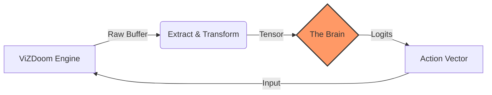

# Golem: The DOOM LNN Project

**Golem** is an open-source initiative to develop autonomous, adaptive agents for *DOOM* using **Liquid Neural Networks (LNNs)**.

Current AI in *DOOM* relies on finite state machines (FSMs) written in the 90s. While functional, they are predictable and stateless. Golem aims to replace these static heuristics with **Neural Circuit Policies (NCPs)**—biologically inspired neural networks that model time as a continuous flow rather than discrete ticks.

!!! quote "Why Liquid Networks?"
    Unlike Large Language Models (LLMs) which hallucinate state, or traditional Reinforcement Learning (RL) which requires millions of training steps, LNNs are:
    
    * **Causal:** They learn cause-and-effect relationships in noisy environments.
    * **Compact:** Runnable on consumer hardware with minimal latency (<20ms).
    * **Continuous:** They handle the variable time-steps of a game engine natively.

---

## 🏗 System Architecture

The project follows a strict **ETL (Extract, Transform, Load)** pipeline pattern to decouple the game engine from the inference model.



### Data Pipeline Phases

1. **Extract (Perception):** Interfaces with `libvizdoom` to capture the raw screen buffer and game variables (health, ammo).
2. **Transform (Normalization):** * **Downsampling:** Bilinear interpolation.
    * **Normalization:** Min-max scaling.
    * **Channel Permutation:**  for PyTorch.
3. **Load (Inference/Training):** Feeds tensors into the **Neural Circuit Policy (NCP)** to generate action probabilities.

---

## 🚀 Setup

!!! warning "System Prerequisites"
    * **Python:** 3.10+
    * **C++ Compiler:** ViZDoom requires a modern C++ compiler (clang/gcc) and libraries (SDL2, OpenAL) if building wheels from source.
    * **Hardware Acceleration:**
    * **Apple Silicon:** Metal (MPS) is supported automatically.
    * **NVIDIA:** Requires CUDA 11.8+.

=== "Bash / Zsh"
    ```bash
    # 1. Create Virtual Environment
    python -m venv .venv
    source ./.venv/bin/activate

    # 2. Install Dependencies
    pip install -r requirements.txt
    ```
=== "Fish"

    ```fish
    # 1. Create Virtual Environment
    python -m venv .venv
    source ./.venv/bin/activate.fish

    # 2. Install Dependencies
    pip install -r requirements.txt
    ```

---

## 🛠 Usage Cycle

Golem operates in a loop. Select a phase below to view the command syntax.

=== "1. Configure"

    Before running, verify your hyperparameters and engine constraints.

    * **`conf/app.yaml`**: Adjust learning rate, batch size, and resolution.
    * **`conf/custom.cfg`**: Modify the available button definitions (the "Superset").

=== "2. Record"

    Launch the engine in **Spectator Mode** to capture training data. You play, the agent watches.

    ```bash
    # Usage: python main.py record --module <module_name>
    python main.py record --module combat
    ```

    | Key | Action |
    | :--- | :--- |
    | `W`, `S` | Move Forward / Back |
    | `A`, `D` | Strafe Left / Right |
    | `Q`, `E` | Turn Left / Right |
    | `Space` | Attack |

=== "3. Inspect"

    Verify your dataset is balanced and normalized before training.

    ```bash
    python main.py inspect
    ```

    !!! tip
        Look for **High Idle Time**. If the agent spends >50% of the time doing nothing, the model will converge to inaction.

=== "4. Train"

    Run the **Behavioral Cloning** loop to create a `.pth` model file.

    ```bash
    # Trains on ALL available data modules
    python main.py train
    ```

=== "5. Run "

    Watch the LNN play the game live.

    ```bash
    python main.py run
    ```

---

## 📜 License

MIT License.

*DOOM is a registered trademark of id Software.*