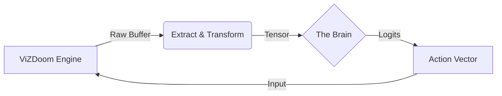

# Golem Architecture Overview

Golem is an autonomous agent framework designed to play *DOOM* using **Liquid Neural Networks (LNNs)**. The system is architected as a strict **ETL (Extract, Transform, Load)** pipeline that decouples the game engine from the inference model.

## System Design

The application logic is divided into three distinct phases, mirroring the flow of data from the game engine to the neural weights and back.

### 1. Extract (Perception)

The extraction layer interfaces with the ZDoom engine via the `libvizdoom` shared object. It captures the raw screen buffer  and the game variables (health, ammo).

### 2. Transform (Normalization)

Raw buffers are unsuitable for neural processing due to high dimensionality and integer pixel values. The transformation layer applies the following mapping :

1. **Downsampling:** Bilinear interpolation to .
2. **Normalization:** Min-max scaling to .
3. **Channel Permutation:**  to satisfy PyTorch memory layout (NCHW).

### 3. Load (Inference/Training)

* **Training:** Data is loaded into a sliding-window `IterableDataset` to preserve temporal causality.
* **Inference:** Tensors are fed into the **Neural Circuit Policy (NCP)**, specifically a Closed-form Continuous (CfC) network, to generate action probabilities.
