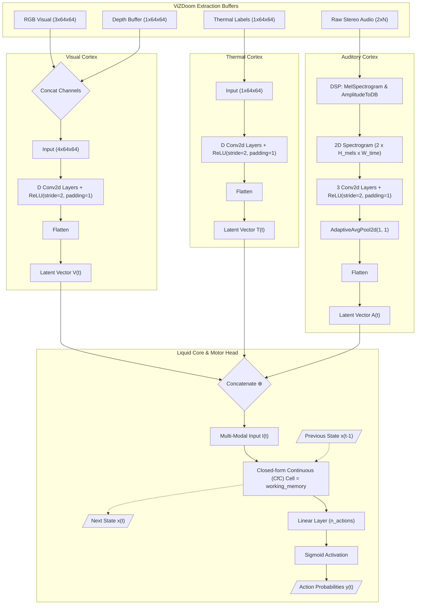

# The Brain: Liquid Neural Networks

The core of Golem is a Neural Circuit Policy (NCP) utilizing Closed-form Continuous-time (CfC) cells. With the introduction of multi-modal sensor fusion, the brain can dynamically scale its perception across visual, spatial (depth), auditory, and thermal domains.

## 1. Visual Cortex (CNN)

The input observation $o_t$ is first processed by a Convolutional Neural Network (CNN) to extract spatial features. This hierarchy reduces the high-dimensional pixel space into a flattened, latent feature vector $V(t)$.

The architecture scales dynamically based on the configured `cortical_depth` ($D$)  and active `sensors`. Given an input tensor of $C\times64\times64$ (where $C=3$ for standard RGB, or $C=4$ if the stereoscopic depth buffer is enabled), the sequential convolutions (using a kernel size of 4, a stride of 2, and a padding of 1 to prevent dropping spatial data on the edges) coupled with ReLU activations compress the spatial manifold. Each convolutional layer effectively halves the spatial dimensions ($H$ and $W$) while doubling the feature channels ($C$). For example, a depth of $D=4$ aggressively pools the feature maps to a highly dense representation, outputting a flattened latent feature vector $V(t)\in\mathbb{R}^{1024}$.

## 2. Auditory Cortex (2D CNN & Mel Spectrograms)

If the `audio` sensor is enabled, Golem expands its phenomenology by processing the raw, high-frequency stereo audio buffer from the engine.

To ensure network stability and prevent gradient explosion, the raw audio arrays are first strictly normalized (zero-mean, unit-variance) during the extraction phase. During data loading and live inference, the normalized 1D waveforms are mathematically converted into dense 2D time-frequency tensors (scaled to decibels) using `torchaudio` transforms.

This transformation allows the network to process audio as a spatial map via a Short-Time Fourier Transform (STFT). The resulting Mel Spectrogram is routed through a parallel 2D Convolutional Neural Network (`nn.Conv2d`). By leveraging spatial locality, this architecture mathematically aligns sound classification with the existing visual processing hierarchy, enabling the model to recognize the "visual" shape of acoustic cues (such as a monster's growl or a plasma rifle firing) while naturally compressing high-frequency acoustic noise.

This pathway consists of sequential 2D convolutions (kernel size 3, stride 2, padding 1) and an AdaptiveAvgPool2d((1, 1)) layer to extract the final auditory features regardless of the variable temporal width ($W_{time}$) generated by the STFT hop length. This outputs a fixed-size latent audio vector $A(t)$.

## 3. Thermal Cortex (Parallel 2D CNN)

If the `thermal` sensor is enabled, Golem utilizes ViZDoom's semantic segmentation `labels_buffer` to decouple spatial navigation from active enemy detection. This isolates dynamic entities (monsters, projectiles, items) from the static background geometry, projecting them as a binary "thermal" mask that severely reduces the visual noise the model must parse during combat.

The extracted binary mask is resized to $1\times64\times64$ utilizing nearest-neighbor interpolation to prevent edge anti-aliasing artifacts, and routed through an isolated, parallel 2D Convolutional Neural Network (nn.Conv2d). This pathway scales identically to the Visual Cortex based on the cortical_depth ($D$), but initiates with a specialized filter width. It utilizes sequential convolutions (kernel size 4, stride 2, padding 1) and ReLU activations, starting at 16 output channels and doubling at each layer, allowing the network to learn independent dynamic entity-tracking filters without interference from static environmental textures.

This pathway compresses the binary mask into a latent thermal vector $T(t)\in\mathbb{R}^{512}$ (at $D=4$).

### Sensor Fusion Concatenation

If multiple modalities are active, their respective flattened feature vectors are dynamically concatenated:

$$
I(t)=V(t)\oplus A(t)\oplus T(t)
$$

Where $I(t)\in\mathbb{R}^{W_f}$ is the final, unified multi-modal representation fed into the liquid core, missing modalities are omitted, and $W_f$ is the total flat size of all active cortices combined.

To guarantee architectural stability and prevent tensor shape mismatches, $W_f$ is no longer calculated via brittle, hardcoded algebra. Instead, it is resolved dynamically at initialization: the network constructs a set of zero-tensors (`torch.zeros()`) matching the configured sensory dimensions and passes them through the respective convolutional pathways inside a `torch.no_grad()` block. The resulting flattened vectors are measured to definitively compute $W_f$, seamlessly supporting arbitrary changes to `cortical_depth` or kernel properties. For example, combining the aforementioned visual ($1024$) and thermal ($512$) cortices yields a unified $W_f=1536$ input vector.

## 4. Liquid Core (CfC) & State Persistence

Standard Recurrent Neural Networks (RNNs) update their hidden state via discrete, uniform steps. In contrast, **Liquid Time-Constant (LTC)** networks model the hidden state $x(t)$  as a continuous-time dynamical system of Ordinary Differential Equations (ODEs) responding to a continuous flow of time:

$$
\frac{dx(t)}{dt}=-\left[w_\tau+f(x(t),I(t);\theta)\right]\odot x(t)+A\odot f(x(t),I(t);\theta)
$$

This ODE dictates that a neural network $f$ not only determines the derivative of the hidden state but also serves as an input-dependent varying time-constant. This enables the network to dynamically adjust its "memory horizon," allowing specific neurons to adapt their coupling sensitivity in real-time.

However, solving this ODE numerically during live gameplay introduces severe computational latency, as traditional numerical solvers (like Runge-Kutta) require multiple iterative evaluations per time step. To achieve the  inference target required by the ViZDoom engine, Golem utilizes the Closed-form Continuous (CfC) approximation (Hasani et al., 2022).

This mathematical formulation bypasses the numerical solver entirely by approximating the integral with a tight, closed-form gating mechanism:

$$
x(t)=\sigma(-f(x,I;\theta_f)t)\odot g(x,I;\theta_g)+\left[1-\sigma(-f(x,I;\theta_f)t)\right]\odot h(x,I;\theta_h)
$$

Where $f$, $g$, and $h$ represent distinct neural network branches parameterizing the state flow, and $\odot$ denotes the Hadamard product. The exponential decay is approximated via the sigmoid activation $\sigma$. This closed-form solution guarantees exponential stability and accelerates training and inference speeds by one to five orders of magnitude compared to strict ODE-based counterparts.

### The "Amnesia" Constraint (Stateful Inference)

Because the underlying differential mathematics assume a continuous temporal flow, the network must accumulate evidence to build action potential. During asynchronous live gameplay (inference), the engine feeds the active cortices discrete buffers. The hidden state  must be explicitly captured and recursively fed back into the network on the subsequent frame. Failing to persist this state across the deployment loop lobotomizes the network 35 times a second, preventing the CfC activation threshold from ever being reached.

## 5. Motor Cortex (Linear Head)

The liquid hidden state $x(t)\in\mathbb{R}^{W_m}$ (where $W_m$ is the dynamically configured `working_memory`, e.g., 64 or 128) is projected to the dynamic action space via a final linear transformation. To accommodate the variable supersets defined by the active profile $\rho$, the output weight matrix dynamically scales its dimensionality $n_\rho\in\{8, 9, 10\}$:

$$
\mathbf{z}_t=W_{out}x(t)+b_{out}
$$

This produces raw logits $\mathbf{z}_t$, which are subsequently passed through a continuous Sigmoid activation function to yield the final predicted probabilities for the multi-label Bernoulli distribution:

$$
\hat{\mathbf{y}}_t=\sigma(\mathbf{z}_t)
$$

---

## API Reference

Because the architecture is fully dynamic, the `DoomLiquidNet` class constructs its layers on-the-fly based on the active `app.yaml` configuration profile, the selected sensor fusion modalities, and the active Digital Signal Processing (DSP) hyperparameters.

::: app.models.brain.DoomLiquidNet